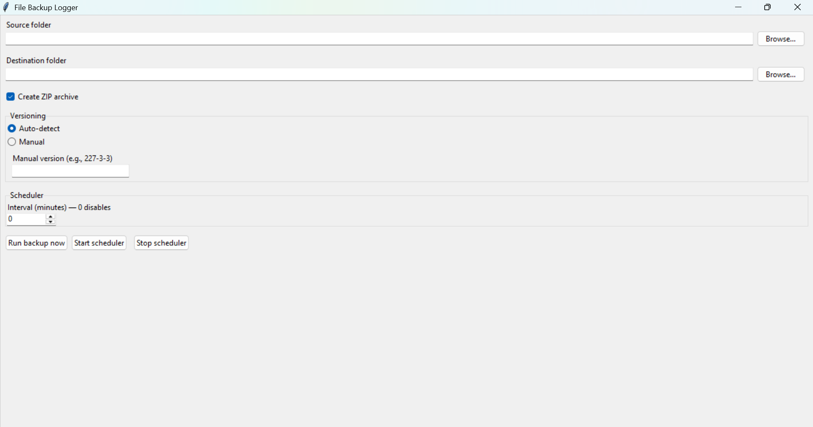
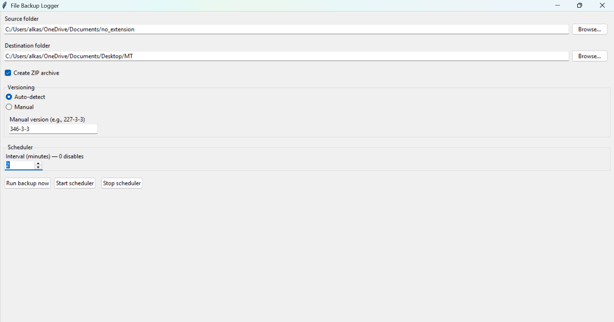
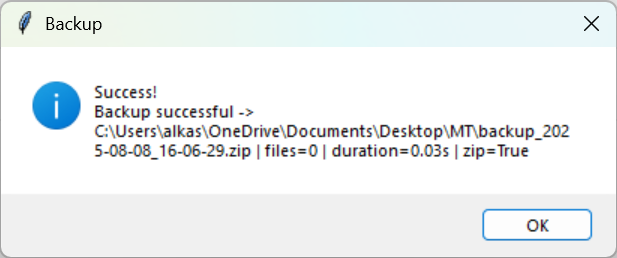
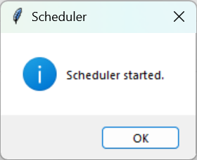

# FileBackupLogger (Python, OOP)

A folder backup tool with versioning, logging, and a Tkinter GUI.

> **Example backup name:** `backup_2025-05-01_12-34-56_v227-3-3`

## Features
- Backup as a plain folder copy or as a ZIP archive.
- Timestamp + version suffix in backup names.
- Auto-detect version from common files (`version.txt`, `VERSION`, `package.json`, `pyproject.toml`, `setup.cfg`, `setup.py`) or set it manually.
- Logging to `backup.log` with status, file count, and duration.
- Clear error handling (missing folder, permission denied, etc.).
- Tkinter GUI to select source/destination, compression, and versioning mode.
- Optional simple scheduler based on a minute interval.
- OOP design with clean module separation.

## Requirements
- Python 3.9+ (standard library only).

## Run
From the project root:
```bash
python -m src.main
# or
python src/main.py
```

## Config (`config.json`)
Created on first run with:
```json
{
  "source": "",
  "destination": "",
  "zip": true,
  "backup_interval_minutes": 0,
  "version_mode": "auto",
  "manual_version": "",
  "preferred_version_files": ["version.txt", "VERSION", "package.json", "pyproject.toml", "setup.cfg", "setup.py"]
}
```

- `source`, `destination`: folder paths.
- `zip`: `true` = create ZIP archive, `false` = plain copy.
- `backup_interval_minutes`: minutes between automatic backups (0 disables scheduler).
- `version_mode`: `auto` to detect a version or `manual` to use `manual_version`.
- `manual_version`: manual version string (e.g., `227-3-3`).

## Notes
- In ZIP mode, a `backup_... .zip` file is created in the destination folder.
- In plain copy mode, a `backup_...` folder is created.
- If no version is detected, the suffix is omitted.
- Test with large folders to ensure permissions and free space.

## Structure
```
FileBackupLogger/
├─ src/
│  ├─ backup.py
│  ├─ config_manager.py
│  ├─ gui.py
│  ├─ logger_setup.py
│  └─ main.py
├─ backup.log       # created automatically
├─ config.json      # created automatically
└─ README.md
```


## Screenshots

### Main GUI (empty)


### Main GUI (filled example)


### Backup success message


### Scheduler started


### Scheduler stopped

